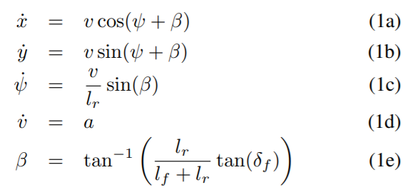
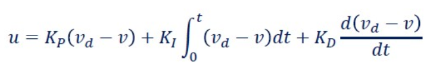
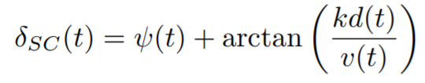

# Path-Tracking
Implementation of a PID, Stanley control for longitudinal and lateral movements respectively. Here, we use a simplified linear Bicycle model 

     
      

## Controllers

- PID controller.

Given the current speed v(t) we minimize the error term e = v_desired − v_current using a PID controller for the throttle value. The range for the throttle values is [-1, 1]. The formula is

     
      

Where KP, KI and KD are proportional, integral and derivative parameters, respectively.

- Stanley Controller.

For lateral control, we adapt the standley control(To learn more about the Stanley Control, check out ref.5). There are two error metrics: the distance to centerline d(t) and the relative angle ψ(t). The control law to calculate the
steering angle δ_{SC}(t) at the current vehicle speed v(t) is given by 

     
      

where k is a gain parameter.

## ToDO Lists:
- [ ] Include a Non-Linear bicycle model for the Stanley controller.
- [ ] For better tracking accuracy, we use the linearly interpolation between waypoints. While We can also use better methods like Cubic spline, Bézier and Hermite interpolation.
- [ ] For better tracking performance, we can also try Non-Linear PID and Optimal control methods like LQR, MPC.
